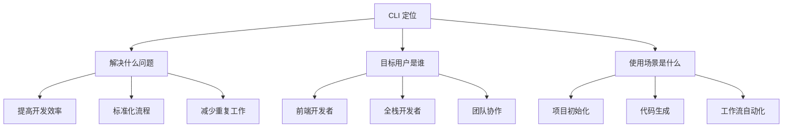

# 如何设计和开发 CLI 工具

开发 CLI 工具需要系统的思维和方法论。以下是完整的设计和开发流程：

## 🎯 第一阶段：需求分析与规划

### 1. 明确 CLI 的定位和目标



### 2. 定义核心价值主张

```typescript
// 明确你的 CLI 要解决的核心问题
interface CLIValueProposition {
  // 效率提升
  efficiency: {
    timeSaved: string; // "减少 80% 的重复编码时间"
    automation: string[]; // ["自动生成组件", "自动配置环境"]
  };

  // 质量保证
  quality: {
    standardization: string; // "统一的代码规范"
    bestPractices: string[]; // ["遵循 Vue 3 最佳实践", "TypeScript 支持"]
  };

  // 学习曲线
  learning: {
    easeOfUse: string; // "直观的交互式界面"
    documentation: string; // "详细的示例和文档"
  };
}
```

### 3. 用户故事和用例分析

```typescript
// 定义典型用户故事
interface UserStory {
  as: string; // "作为一名前端开发者"
  iWant: string; // "我想要快速生成 Vue 组件"
  soThat: string; // "这样我可以专注于业务逻辑而不是样板代码"
}

const userStories: UserStory[] = [
  {
    as: "新项目开发者",
    iWant: "一键初始化项目结构",
    soThat: "快速开始开发而不需要手动配置",
  },
  {
    as: "团队技术负责人",
    iWant: "统一的代码生成规范",
    soThat: "保证团队代码风格一致",
  },
  {
    as: "个人开发者",
    iWant: "灵活的模板定制",
    soThat: "根据个人喜好调整生成的代码",
  },
];
```

## 🏗️ 第二阶段：架构设计

### 4. 设计 CLI 命令结构

```bash
# 命令层次结构设计
my-cli/
├── 项目级别命令
│   ├── init [project-name]     # 初始化项目
│   ├── build                   # 构建项目
│   └── deploy                  # 部署项目
├── 代码生成命令
│   ├── generate component      # 生成组件
│   ├── generate page          # 生成页面
│   ├── generate store         # 生成状态管理
│   └── generate api           # 生成 API 层
├── 工具类命令
│   ├── config                 # 配置管理
│   ├── plugin                 # 插件管理
│   └── doctor                 # 环境诊断
└── 信息类命令
    ├── --help, -h             # 帮助信息
    ├── --version, -v          # 版本信息
    └── list                   # 列出可用生成器
```

### 5. 设计配置系统

```typescript
// 分层配置设计
interface CLIConfig {
  // 用户级配置 (～/.my-cli/config.json)
  user: {
    theme: "light" | "dark";
    editor: string;
    defaultTemplate: string;
  };

  // 项目级配置 (./.my-cli.json)
  project: {
    framework: "vue" | "react" | "angular";
    language: "javascript" | "typescript";
    style: "css" | "scss" | "less";
  };

  // 运行时配置
  runtime: {
    currentCommand: string;
    debug: boolean;
    silent: boolean;
  };
}
```

### 6. 设计扩展机制

```typescript
// 插件系统设计
interface PluginSystem {
  // 插件发现和加载
  discovery: {
    local: string; // 本地插件目录
    remote: string; // 远程插件仓库
    registry: string; // 插件注册表
  };

  // 插件接口
  interface: {
    hooks: string[]; // 生命周期钩子
    commands: string[]; // 可扩展命令
    templates: string[]; // 模板扩展
  };

  // 插件管理
  management: {
    install: string; // 安装插件
    uninstall: string; // 卸载插件
    update: string; // 更新插件
    list: string; // 列出插件
  };
}
```

## 🔧 第三阶段：技术实现

### 7. 选择合适的技术栈

```typescript
// CLI 技术栈选择标准
interface TechStackCriteria {
  // 核心要求
  requirements: {
    performance: "high" | "medium" | "low";
    bundleSize: "small" | "medium" | "large";
    startupTime: "fast" | "medium" | "slow";
  };

  // 开发体验
  development: {
    language: "typescript" | "javascript";
    testing: "jest" | "vitest" | "mocha";
    bundler: "webpack" | "rollup" | "esbuild";
  };

  // 用户体验
  userExperience: {
    interactivity: "high" | "medium" | "low";
    feedback: "rich" | "basic";
    customization: "extensive" | "moderate" | "minimal";
  };
}

// 推荐技术栈
const recommendedStack = {
  core: {
    cliFramework: "commander", // 命令解析
    interactive: "inquirer", // 用户交互
    styling: "chalk", // 终端样式
  },
  templates: {
    engine: "handlebars", // 模板引擎
    helpers: "custom", // 自定义辅助函数
  },
  development: {
    language: "typescript", // 开发语言
    testing: "vitest", // 测试框架
    bundler: "esbuild", // 打包工具
  },
};
```

### 8. 设计核心架构模式

```typescript
// 微内核架构模式
class CLIKernel {
  private plugins: Map<string, Plugin> = new Map();
  private commands: Map<string, Command> = new Map();
  private services: Map<string, Service> = new Map();

  // 生命周期管理
  async bootstrap() {
    await this.loadCoreServices();
    await this.loadPlugins();
    await this.registerCommands();
    await this.initialize();
  }

  // 插件管理
  async loadPlugin(pluginPath: string) {
    const plugin = await this.loadPluginModule(pluginPath);
    await this.validatePlugin(plugin);
    await this.registerPlugin(plugin);
  }

  // 命令执行
  async executeCommand(commandName: string, args: any) {
    const command = this.commands.get(commandName);
    if (!command) {
      throw new Error(`Command ${commandName} not found`);
    }

    // 前置钩子
    await this.executeHook("pre-command", { commandName, args });

    // 执行命令
    const result = await command.execute(args);

    // 后置钩子
    await this.executeHook("post-command", { commandName, args, result });

    return result;
  }
}
```

### 9. 实现错误处理策略

```typescript
// 分层的错误处理
class ErrorHandler {
  // 错误分类
  static ErrorTypes = {
    USER: "user_error", // 用户输入错误
    SYSTEM: "system_error", // 系统错误
    NETWORK: "network_error", // 网络错误
    VALIDATION: "validation_error", // 验证错误
  };

  // 错误处理策略
  static handleError(error: Error, context: any) {
    const errorType = this.classifyError(error);

    switch (errorType) {
      case this.ErrorTypes.USER:
        return this.handleUserError(error, context);
      case this.ErrorTypes.SYSTEM:
        return this.handleSystemError(error, context);
      case this.ErrorTypes.NETWORK:
        return this.handleNetworkError(error, context);
      default:
        return this.handleUnknownError(error, context);
    }
  }

  // 用户友好的错误消息
  static formatUserMessage(error: Error): string {
    const messages = {
      FileNotFound: "文件未找到，请检查路径是否正确",
      PermissionDenied: "权限不足，请检查文件权限",
      NetworkTimeout: "网络请求超时，请检查网络连接",
    };

    return messages[error.name] || error.message;
  }
}
```

## 🎨 第四阶段：用户体验设计

### 10. 设计交互流程

```typescript
// 交互式命令设计模式
class InteractiveCommand {
  async execute() {
    // 1. 欢迎和介绍
    await this.showWelcome();

    // 2. 收集用户输入
    const config = await this.collectConfiguration();

    // 3. 验证和确认
    const confirmed = await this.confirmConfiguration(config);
    if (!confirmed) {
      return this.restartOrExit();
    }

    // 4. 执行操作
    const result = await this.performAction(config);

    // 5. 显示结果和后续步骤
    await this.showResult(result);
    await this.suggestNextSteps(result);
  }

  private async collectConfiguration() {
    // 渐进式配置收集
    return await inquirer.prompt([
      // 基础配置
      {
        type: "input",
        name: "name",
        message: "项目名称",
        validate: this.validateName,
      },
      // 技术栈选择
      {
        type: "list",
        name: "framework",
        message: "选择框架",
        choices: ["Vue", "React", "Angular"],
      },
      // 高级配置 (条件显示)
      {
        type: "confirm",
        name: "advanced",
        message: "显示高级配置",
        default: false,
      },
      {
        type: "checkbox",
        name: "features",
        message: "选择功能",
        choices: ["Router", "State Management", "Testing"],
        when: (answers) => answers.advanced,
      },
    ]);
  }
}
```

### 11. 设计输出和反馈

```typescript
// 丰富的输出反馈系统
class OutputRenderer {
  private spinner: any;
  private progress: any;

  // 进度指示
  async showProgress(message: string, action: () => Promise<any>) {
    this.spinner = ora(message).start();
    try {
      const result = await action();
      this.spinner.succeed();
      return result;
    } catch (error) {
      this.spinner.fail();
      throw error;
    }
  }

  // 结构化输出
  showResult(result: any) {
    console.log("\n" + chalk.bold.blue("🎉 生成完成!"));
    console.log("\n" + chalk.bold("生成的文件:"));

    result.generatedFiles.forEach((file: any) => {
      const status = file.success ? chalk.green("✓") : chalk.red("✗");
      console.log(`  ${status} ${file.path}`);
    });

    // 后续步骤建议
    if (result.nextSteps && result.nextSteps.length > 0) {
      console.log("\n" + chalk.bold("接下来你可以:"));
      result.nextSteps.forEach((step: string, index: number) => {
        console.log(`  ${chalk.cyan(index + 1 + ".")} ${step}`);
      });
    }
  }

  // 错误展示
  showError(error: Error, suggestion?: string) {
    console.log("\n" + chalk.red("❌ 出错了!"));
    console.log(chalk.gray(error.message));

    if (suggestion) {
      console.log("\n" + chalk.yellow("💡 建议:"));
      console.log(chalk.gray(suggestion));
    }

    // 调试信息
    if (process.env.DEBUG) {
      console.log("\n" + chalk.gray("调试信息:"));
      console.log(chalk.gray(error.stack));
    }
  }
}
```

## 🔄 第五阶段：开发工作流

### 12. 实现版本化开发

```typescript
// 语义化版本管理
class VersionStrategy {
  // 版本号规则: major.minor.patch
  static async determineNextVersion(
    current: string,
    changes: Change[]
  ): Promise<string> {
    const hasBreaking = changes.some((change) => change.type === "breaking");
    const hasFeature = changes.some((change) => change.type === "feature");

    const [major, minor, patch] = current.split(".").map(Number);

    if (hasBreaking) {
      return `${major + 1}.0.0`;
    } else if (hasFeature) {
      return `${major}.${minor + 1}.0`;
    } else {
      return `${major}.${minor}.${patch + 1}`;
    }
  }

  // 变更日志生成
  static generateChangelog(version: string, changes: Change[]): string {
    const sections = {
      breaking: "💥 Breaking Changes",
      feature: "✨ New Features",
      fix: "🐛 Bug Fixes",
      docs: "📚 Documentation",
    };

    let changelog = `## ${version}\n\n`;

    Object.entries(sections).forEach(([type, title]) => {
      const typeChanges = changes.filter((change) => change.type === type);
      if (typeChanges.length > 0) {
        changelog += `### ${title}\n\n`;
        typeChanges.forEach((change) => {
          changelog += `- ${change.description}\n`;
        });
        changelog += "\n";
      }
    });

    return changelog;
  }
}
```

### 13. 设计测试策略

```typescript
// 分层测试策略
class TestStrategy {
  // 单元测试
  static unitTests = {
    core: ["TemplateEngine", "InteractivePrompter", "ActionExecutor"],
    utils: ["handlebarsHelpers", "fileUtils", "stringUtils"],
    types: ["类型定义验证"],
  };

  // 集成测试
  static integrationTests = {
    commands: ["GenerateCommand", "InteractiveCommand"],
    generators: ["ComponentGenerator", "PageGenerator"],
    workflows: ["完整生成流程"],
  };

  // E2E 测试
  static e2eTests = {
    scenarios: [
      "初始化新项目",
      "生成组件并验证输出",
      "错误处理流程",
      "插件系统测试",
    ],
  };

  // 测试工具配置
  static setup() {
    return {
      runner: "vitest",
      coverage: {
        statements: 80,
        branches: 75,
        functions: 80,
        lines: 80,
      },
      reporters: ["default", "html"],
    };
  }
}
```

## 🚀 第六阶段：发布和维护

### 14. 发布流程设计

```typescript
// 自动化发布流程
class ReleaseProcess {
  static async release() {
    // 1. 预发布检查
    await this.preReleaseChecks();

    // 2. 运行测试
    await this.runTests();

    // 3. 构建项目
    await this.buildProject();

    // 4. 版本号更新
    const newVersion = await this.updateVersion();

    // 5. 生成变更日志
    await this.generateChangelog(newVersion);

    // 6. 提交和打标签
    await this.commitAndTag(newVersion);

    // 7. 发布到 npm
    await this.publishToNpm();

    // 8. 创建 GitHub Release
    await this.createGitHubRelease(newVersion);
  }

  private static async preReleaseChecks() {
    const checks = [
      "检查是否有未提交的更改",
      "检查主分支状态",
      "验证 package.json 配置",
      "检查依赖安全性",
    ];

    for (const check of checks) {
      await this.runCheck(check);
    }
  }
}
```

### 15. 维护和更新策略

```typescript
// 长期维护计划
class MaintenanceStrategy {
  // 支持周期
  static supportTimeline = {
    active: "18 months", // 活跃开发
    maintenance: "12 months", // 维护模式
    security: "6 months", // 仅安全更新
  };

  // 更新策略
  static updateStrategy = {
    major: {
      frequency: "12-18 months",
      breakingChanges: "允许",
      migrationGuide: "必需",
    },
    minor: {
      frequency: "3-6 months",
      breakingChanges: "不允许",
      newFeatures: "允许",
    },
    patch: {
      frequency: "1-4 weeks",
      breakingChanges: "不允许",
      bugFixes: "主要",
    },
  };

  // 弃用策略
  static deprecationPolicy = {
    noticePeriod: "6 months",
    migrationPath: "提供迁移工具",
    documentation: "更新文档",
  };
}
```

## 📋 开发检查清单

### 开始前检查

- [ ] 明确要解决的问题
- [ ] 定义目标用户和使用场景
- [ ] 分析现有解决方案的不足
- [ ] 确定核心价值主张

### 设计阶段检查

- [ ] 设计清晰的命令结构
- [ ] 规划配置管理系统
- [ ] 设计扩展机制
- [ ] 制定错误处理策略

### 开发阶段检查

- [ ] 搭建项目基础架构
- [ ] 实现核心功能模块
- [ ] 编写单元测试和集成测试
- [ ] 优化用户体验和交互流程

### 发布前检查

- [ ] 完成文档编写
- [ ] 进行充分测试
- [ ] 准备发布说明
- [ ] 制定维护计划
